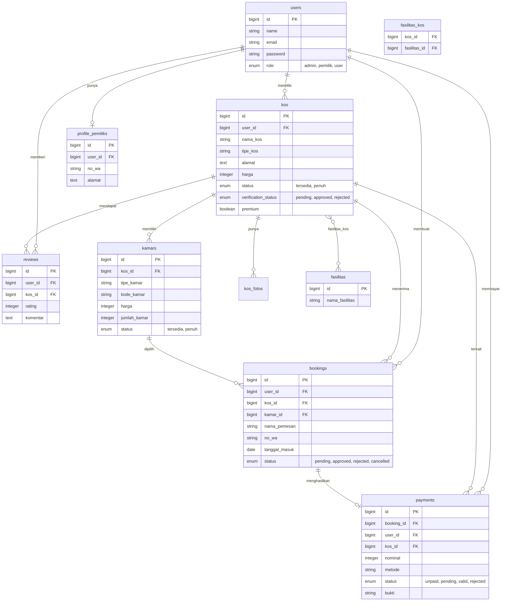

# ERD KosKu

Relasi utama sistem KosKu:

## Catatan relasi

- `users.role` membedakan admin, pemilik kos, dan pencari kos.
- Pemilik kos memiliki banyak data `kos`, sedangkan user pencari kos dapat membuat `bookings`, `reviews`, dan `payments`.
- `kos` memiliki banyak `kamars`, foto tambahan, review, dan booking.
- Relasi many-to-many antara `kos` dan `fasilitas` disimpan pada tabel pivot `fasilitas_kos`.
- `payments` dibuat dari `bookings` yang sudah diterima.
